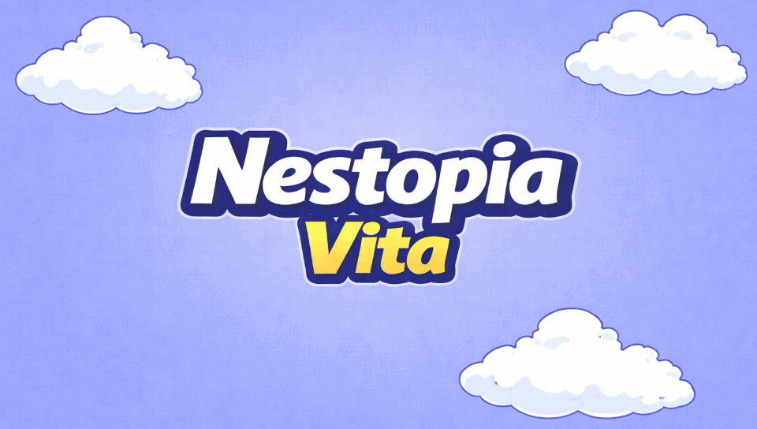

# Nestopia Vita

A standalone NES emulator for PlayStation Vita, powered by the [Nestopia](https://github.com/cysin/nestopia) emulation core.



## Features

- Full-speed NES emulation on PS Vita
- RGUI in-game menu (Select + Start)
- Save states (multiple slots)
- ROM browser with ZIP archive support
- Configurable controls with per-game bindings
- Turbo A / Turbo B buttons
- Game Genie cheat support
## Installation

1. Download the latest `nestopia-vita.vpk` from [Releases](https://github.com/cysin/nestopia-vita/releases)
2. Transfer the VPK to your Vita
3. Install using VitaShell
4. Place NES ROMs (`.nes`, `.zip`) in `ux0:/data/nestopia-vita/roms/`

## Controls

| Vita Button | NES Button |
|-------------|------------|
| Cross       | B          |
| Circle      | A          |
| Square      | Turbo B    |
| Triangle    | Turbo A    |
| D-Pad       | D-Pad      |
| Start       | Start      |
| Select      | Select     |
| Select + Start | Open RGUI Menu |

## Building from Source

### Prerequisites

- [VitaSDK](https://vitasdk.org/)
- CMake 3.10+
- libarchive (with zlib, bz2, zstd)

### Build

```bash
git clone --recurse-submodules https://github.com/cysin/nestopia-vita.git
cd nestopia-vita
mkdir build && cd build
cmake -DPLATFORM_VITA=ON -DCMAKE_BUILD_TYPE=Release ..
make -j$(nproc)
```

## Credits

- [Nestopia UE](https://github.com/cysin/nestopia) - NES emulation core
- [libcross2d](https://github.com/Cpasjuste/libcross2d) - Cross-platform 2D library
- [pemu](https://github.com/Cpasjuste/pemu) - Portable emulator framework

## License

GPL-3.0
